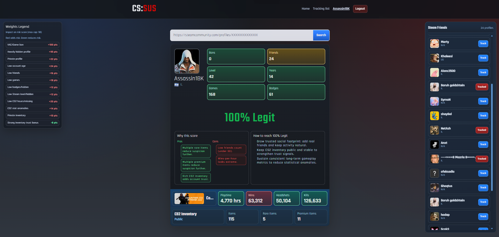
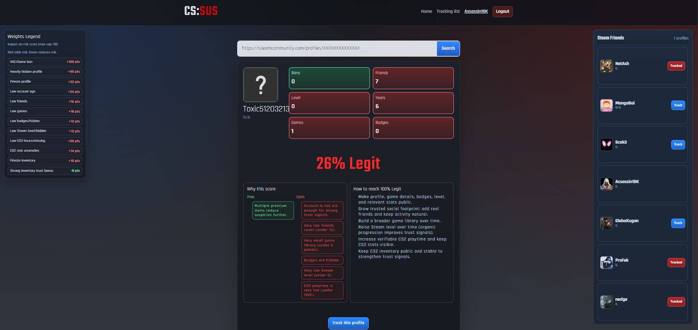
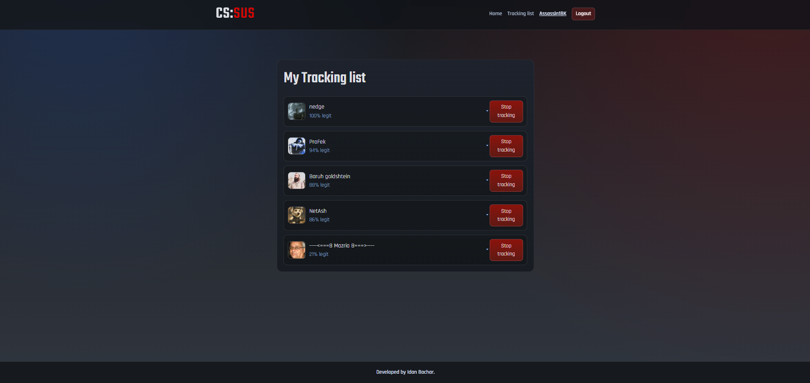
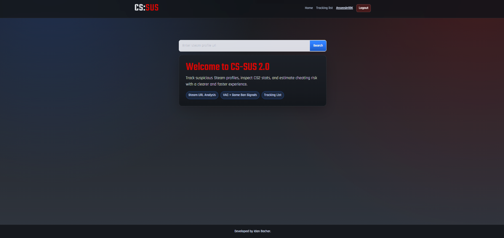

# CS-SUS

Modern Next.js rebuild of CS-SUS using App Router, TypeScript, Steam API hydration, and score-based profile risk analysis.

## Stack

- Next.js 16 (App Router)
- React 19
- TypeScript
- NextAuth (Steam OpenID)
- Zod validation
- SWR data fetching
- Supabase (optional) with automatic local fallback store

## Current features

- Steam profile search flow from UI to server routes
- Profile hydration from Steam API (single and batch)
- Cheater score engine with reason codes
- Login flow via Steam provider in NextAuth
- Tracking list API and UI (add, remove, list)
- Storage abstraction:
	- Supabase store when configured
	- Local file store fallback in `.data/tracking.json`

## Screenshots

### Home



### Search result (low trust profile)



### Search result (high trust profile)



### Tracking list



## App routes

- `/` home page
- `/search` profile search and results
- `/login` auth entry page
- `/myTrackingList` tracked users view

## API routes

- `GET /api/steam/user?steamUrl=...`
	- Resolves a Steam profile URL to Steam ID and returns full hydrated user data.
- `POST /api/steam/users`
	- Accepts `{ steamUrls: string[] }` (max 50), deduplicates IDs, returns hydrated users.
- `POST /api/tracking/add`
	- Requires auth session. Body: `{ targetSteamUrl: string }`.
- `GET /api/tracking/list?ownerSteamId=...`
	- Requires auth session and enforces owner/session match.
- `POST /api/tracking/remove`
	- Requires auth session. Body: `{ targetSteamId: string }`.
- `GET|POST /api/auth/[...nextauth]`
	- NextAuth endpoints with Steam provider wiring.

## Environment variables

Create `.env.local` and set:

```bash
STEAM_SECRET=
STEAM_API_KEY=
STEAM_BASE_URL=https://api.steampowered.com

NEXTAUTH_SECRET=
NEXTAUTH_URL=http://localhost:3000

SUPABASE_URL=
SUPABASE_SERVICE_ROLE_KEY=
NEXT_PUBLIC_SUPABASE_URL=
NEXT_PUBLIC_SUPABASE_ANON_KEY=
```

Notes:

- `STEAM_API_KEY` is required for Steam data routes.
- `STEAM_SECRET` (or `STEAM_API_KEY` fallback) is required for Steam auth provider.
- If `NEXTAUTH_SECRET` is empty in local dev, a temporary insecure fallback secret is used.
- Supabase is optional. If missing, tracking uses local file storage automatically.

## Local development

```bash
npm install
npm run dev
```

Open `http://localhost:3000`.

## Available scripts

```bash
npm run dev
npm run dev:webpack
npm run build
npm run start
npm run lint
```

## Supabase setup (optional)

1. Create a Supabase project.
2. Run schema from `supabase/schema.sql`.
3. Add Supabase env vars to `.env.local`.
4. Restart the Next.js dev server.

## Known gaps / next steps

1. Persist richer user profile metadata immediately after Steam auth callback.
2. Add rate limiting and explicit cache policy for Steam API routes.
3. Expand results UI for full parity (friends carousel, CS2 card depth, reasons breakdown UX).
